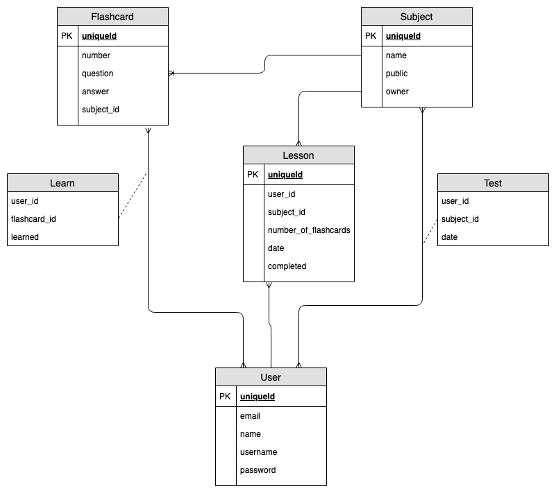
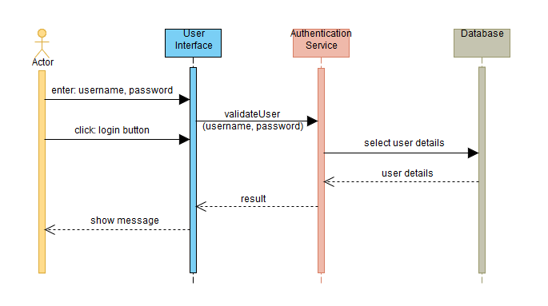
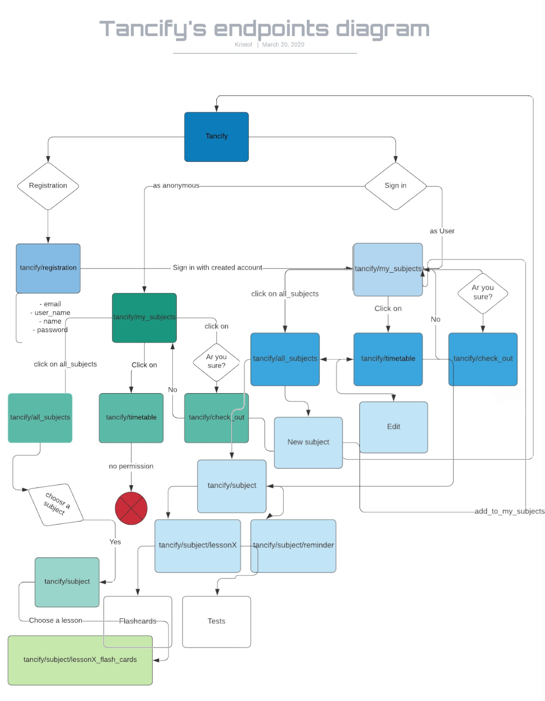

# Tancify

Tanulás segítő webalkalmazas, ami a tárgyak elvégzesét segíti, a tananyag beosztásával, flashcardokkal való elsajátításával és állandó számonkérésekkel. Heti összesítéseket küld, amivel emlekezteti a regisztrált felhasználót előrehaladásáról.

## Funkcionális követelmények

* regisztrálás
* belépés
* naptár 

    * szerkesztés

        * tananyag beosztása
        * optimális menetrend kiszamítása

    * személyre szabás
    * lekérdezés
    * emlékeztető funkció

        * választható funkciók

* tantárgyak

    * új létrehozás
    * "flashcards"

        * tanulas
        * teszt
        * hozzáadás / szerkesztés

    * teszt kitöltés

## Nem funkcionális követelmények

* használhatóság (Felhasználóbarát, ergonomikus elrendezés és kinézet)
* megbizhatóság (Biztonságos működés: jelszavak tárolása, funkciókhoz való hozzáférés.)
* hordozhatóság
* hatékonyság

## Szakterületi fogalomjegyzék:

(azon fogalmak definiálása, ami köré az alkalmazás épül)

## Adatbázis

<h2 align="center">

</h2>

## Szekvenciadiagram

<h2 align="center">

</h2>

## Szerepkörök

* vendég: hozzáfér a tantárgyakhoz és az azokban található leckékhez, megnézheti a bennük szereplő tanulókártyákat
* felhasználó: a vendég szerepkörén túl új tantárgyakat hozhat létre, új kérdéseket adhat hozzá egy tantárgyhoz
              (/leckéhez), továbbá használhatja az órarend funkciót, amelyben a tantárgyai, és számonkéréseinek 
              időpontja található, és tárgyanként egy optimális tanulási tervet
* operátor:  a felhasználó szerepkörén túl törölhet tantárgyat vagy kérdést is

## Végpont tervek 

<h2 align="center">

</h2>

    
    POST /login : email és jelszó megadása után be tud lépni a felhasználó
    POST /register : név, email, jelszó megadásával lehet regisztrálni
    GET /generate_lessons{test_id} : generál egy optimális időbeosztást tárgyanként a felhasználónak
    GET /list_lessons{test_id} : kilistázza a felhasználó egy tárgyához tartozó leckéket
    POST /modify_lessons : leckék módosítása
    GET /show_lesson{lesson_id} : leckéhez tartózó "flashcard"-ok megjelenítése
    POST /check_lesson : leckéhez tartozó tesztre adott válaszok ellenörzése, egy rossz válasz esetén, újra kell 
                          próbálkozni a teszt kitöltésével, hibátlan teszt esetén elvégzett leckének  
    GET /user_subjects : megjeleníti a felhasználóhoz tartozó tantárgyakat
    GET /all_subjects : megjeleníti az összes tantárgyat 
    POST /add_subject : új tantárgy létrehozása
    POST /modifysubject : tantárgy módosítása
    GET /query_subject{subject_id} : tantárgy megjelenítése
    GET /lesson_for_subject{subject_id} : visszatér a tantárgyakhoz tartozó leckékkel
    POST /sign_subject : felhasználó felveszi a tantárgyai közé az adott tárgyat
    POST /add_flashcard : új tanulókártya létrehozása
    POST /modify_flaschcards{subject_id} : tanulókártya módosítása
    GET /query_flashcard{falshcard_id} : tanulókártya megjelenítése
    GET /query_flashcards_for_subject{subject_id} : megjeleníti az összes "flashcard"-ot ami az adott tárgyhoz tartozik 