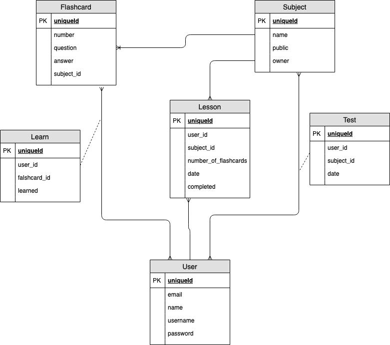

# Tancify

Tanulás segítő webalkalmazas, ami a tárgyak elvégzesét segíti, a tananyag beosztásával, flashcardokkal való elsajátításával és állandó számonkérésekkel. Heti összesítéseket küld, amivel emlekezteti a regisztrált felhasználót előrehaladásáról.

## Funkcionális követelmények

* regisztrálás
* belépés
* naptár 

    * szerkesztés

        * tananyag beosztása
        * optimális menetrend kiszamítása

    * személyre szabás
    * lekérdezés
    * emlékeztető funkció

        * választható funkciók

* tantárgyak

    * új létrehozás
    * "flashcards"

        * tanulas
        * teszt
        * hozzáadás / szerkesztés

    * teszt kitöltés

## Nem funkcionális követelmények

* használhatóság
* megbizhatóság
* hordozhatóság
* hatékonyság

## Adatbazis

<h2 align="center">

</h2>

## Szekvenciadiagram

<h2 align="center">

</h2>

## Vegpont tervek 

<h2 align="center">

</h2>

    GET tancify: querying tancify (you can sign in here and click on registration)
    GET tancify/registration: querying registration (yuo need to add your: name, user_name, email, password) 

    GET tancify/my_subjects: querying all_subjects
    GET tancify/my_subjects/history: querying an element (a subject) with history identifier from model my_subjects
    GET tancify/my_subjects/history/lesson_1: querying an element (a lesson) with lesson_1 identifier from model 
        lessons of history subject
    GET tancify/my_subjects/history/test_1: querying an element (a lesson) with test_1 identifier from model lessons
         of history subject
    GET tancify/my_subjects/history/all_lessons_questions: querying an element with all_lessons_questions identifier
         from model lessons of history subject
    GET tancify/my_subjects/history/all_tests_questions: querying an element with all_tests_questions identifier from
         model lessons of history subject
    POST tancify/my_subject: Inserting new element (new lesson or test) into my_subjects model
    PUT tancify/my_subjects/history: Updating element with history identifier in model my_subjects
    PATCH tancify/my_subjects/history: Partially updating element with history identifier in model my_subjects 
        (e.g add new question-answer to flashcards or tests)
    PATCH tancify/my_subjects/history/lesson_1: Partially updating element with lesson_1 identifier in model
         my_subjects (e.g add new question-answer to flashcards of lesson_1)
    DELETE tancify/all_subjects/history: Deleting element with history identifier from model people

    GET tancify/all_subjects: querying all_subjects
    GET tancify/all_subjects/history: querying an element (a subject) with history identifier from model all_subjects
	GET tancify/all_subjects/history/lesson_1: querying an element (a lesson) with lesson_1 identifier from model lessons
         of history subject
    GET tancify/all_subjects/history/test_1: querying an element (a lesson) with test_1 identifier from model lessons of
         history subject
    GET tancify/all_subjects/history/all_lessons_questions: querying an element with all_lessons_questions identifier from
         model lessons of history subject
    GET tancify/all_subjects/history/all_tests_questions: querying an element with all_tests_questions identifier from model
         lessons of history subject
    POST tancify/all_subjects: Inserting new element into all_subjects model
    PUT tancify/all_subjects/history: Updating element with history identifier in model all_subjects
    PATCH tancify/all_subjects/history: Partially updating element with history identifier in model all_subjects
         (e.g add new lesson or test)
	POST tancify/all_subjects/history/lesson_1: Inserting new element into history model
    PUT tancify/all_subjects/history/lesson_1: Updating element with lesson_1 identifier in model history
    PATCH tancify/all_subjects/history/lesson_1: Partially updating element with lesson_1 identifier in model history
         (e.g add new question-answer to flashcards or tests)
    DELETE tancify/all_subjects/history: Deleting element with history identifier from model /all_subjects

    GET tancify/timetable: querying timetable
    GET tancify/timetable/history: querying an element (a subject) with history identifier from model all_subjects
    POST tancify/timetable: Inserting new element into timetable model
    PUT tancify/timetable/history: Updating element with history identifier in model timetable
    PATCH tancify/timetable/history: Partially updating element with history identifier in model timetable
    DELETE tancify/timetable/history: Deleting element with history identifier from model timetable